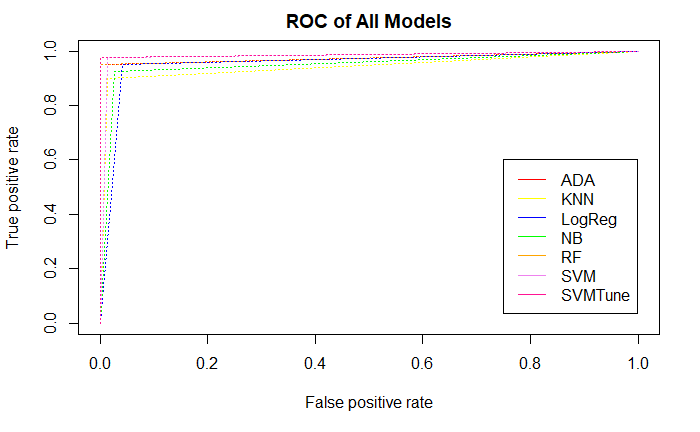

# Conclusion

As we discussed in the beginning of the research, the purpose of this project was to determine the best possible algorithm for breast cancer diagnostics using the Wisconsin breast cancer diagnostics dataset. The data was processed and refined using Principal Component Analysis. This was used to reduce the features based into three main principal components that helped define the dataset. The implementation process was performed using machine learning algorithms such as Adaboost algorithm, K-Nearest Neighbour algorithm, Logistic Regression algorithm, Naïve Bayes Algorithm and Support Vector Machine Algorithm.
Based on the results obtained it can be concluded that SVM performs the best with an accuracy of 99.12% and sensitivity of 100%. Apart from SVM, Adaboost and Random Forest algorithms performed significantly well with accuracy of 98.25% each as compared to KNN and Logistic Regression.

Table 8. Comparison of all models developed

|            |   Adaboost	  |   KNN	 | Logistic-Regression	| Naïve-Bayes	| Random-Forest	|  SVM	|  SVM-Tune |
|:---        |     :---:    | :---:  |        :---:         |   :---:     |     :---:     |  :---:|    :---:  |
|Accuracy    |	    98.25	  |  95.61 |       95.61	        |   95.61	    |  98.25	      |  98.25|	  99.12   |
|Sensitivity |	      100	  |  98.65 |       95.95	        |   97.30	    |    100	      | 98.65	|   100     |
 
This result can also be observed in the ROC plot generated wherein all the models have been compared and represented.

Based on these results it can be concluded that Support vector machine algorithm is the most efficient algorithm for breast cancer diagnostics.

