# **Implemenation Process**

### Adaboost Algorithm

Based on the methodology of Adaboost, we compute this model for breast cancer diagnostics data set. The aim is to evaluate the accuracy and the sensitivity with which the data is being processed and the efficiency of results generated 
 
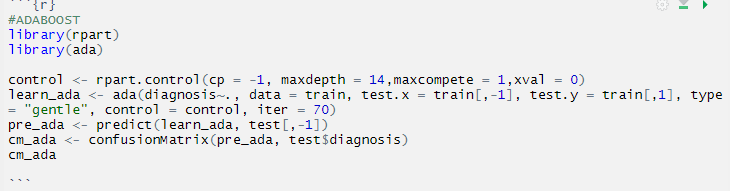

Based on this research the results obtained on computation of Adaboost algorithm on breast cancer dataset is observed as follows:
Table 1.  Confusion Matrix of Adaboost Algorithm
Prediction	Benign	Malignant
Benign	      74	      2
Malignant	     0	     38

The above table represents the accuracy of data prediction carried out by Adaboost model. Here, we can observe an error where two PN predictions have been noted. This implies that the model contains minute but some level of error due to which an inaccurate result has been obtained.
The accuracy and sensitivity observed are as follows
•	Accuracy: 98.25%
•	Sensitivity: 100%
Based on this generated data, we have designed a plot representing the ROC curve of the model which is explained as follows:

 

In this plot we can see the ROC curve with the calculated AUC value. ROC represents the sensitivity with which accurate data has been generated i.e. close to 0.98 whereas AUC i.e. 0.96, is the area that is calculated under the curve generated by the optimal accuracy that is calculated.

### K-Nearest Neighbour Algorithm

Based on the methodology of K- Nearest Neighbour algorithm, we compute this model for breast cancer diagnostics data set. The aim is to evaluate the accuracy and the sensitivity with which the data is being processed and the efficiency of results generated. In this case instead of calculating the accuracy based on one single ‘K’ value we tune the data to compute the model using ‘n’ ‘K’ values. 

 
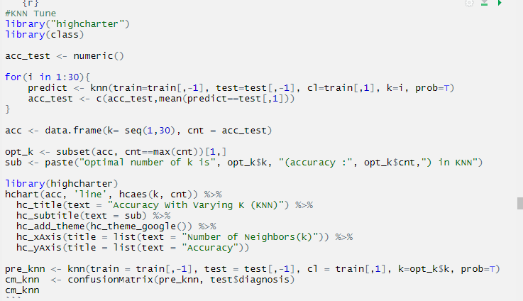 

 
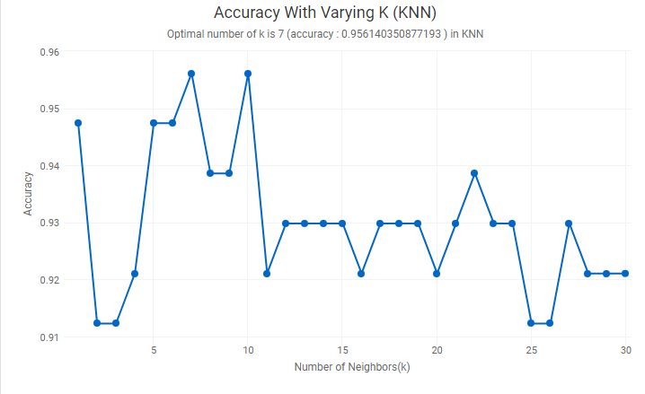  

Here we can see the accuracy generated when different k values are being considered. As seen in the image the optimal value generating substantial frequency is 7.
Based on this research the results obtained on computation of K- Nearest Neighbour algorithm on breast cancer dataset is observed as follows:
Table 2.  Confusion Matrix of KNN algorithm
Prediction	Benign	Malignant
Benign	      73	      4
Malignant	     1	     36

The results can be observed here, based on the matrix table we can see that there is one NP prediction detected and 4 PN predictions detected. This data can be used to conclude that the error rate of this algorithm is high in regard to the given data set. Thus, if implemented may lead to many false diagnostics like diagnosing a benign tumour as malignant or a malignant tumour as benign, both of which are equally harmful thus rendering this system inefficient.  
The accuracy and the sensitivity observed are as follows:
•	Accuracy: 95.61%
•	Sensitivity: 98.65%

Based on this generated data, we have designed a plot representing the ROC curve of the model which is explained as follows:
 
  

In this plot we can see the ROC curve with the calculated AUC value. ROC represents the sensitivity with which accurate data has been generated i.e. close to 0.95 whereas AUC i.e. 0.94, is the area that is calculated under the curve generated by the optimal accuracy that is calculated.

### Logistic Regression Algorithm

Based on the methodology of Logistic Regression algorithm, we compute this model for breast cancer diagnostics data set. The aim is to evaluate the accuracy and the sensitivity with which the data is being processed and the efficiency of results generated.
 
  

Based on this research the results obtained on computation of Logistic Regression algorithm on breast cancer dataset is observed as follows:
Table 3.  Confusion Matrix for Logistic Regression
Prediction	Benign	Malignant
Benign	      71	      2
Malignant	     3	     38

Based on the above table we can see that there have been 2 PN predictions and 3 NP predictions which renders the algorithm inefficient as the error ratio is very high in this output. 
•	Accuracy: 95.61%
•	Sensitivity: 95.95%
Based on this generated data, we have designed a plot representing the ROC curve of the model which is explained as follows:
 
 

In this plot we can see the ROC curve with the calculated AUC value. ROC represents the sensitivity with which accurate data has been generated i.e. close to 0.95 whereas AUC i.e. 0.95, is the area that is calculated under the curve generated by the optimal accuracy that is calculated.

### Naïve Bayes Algorithm

Based on the methodology of Naïve Bayes algorithm, we compute this model for breast cancer diagnostics data set. The aim is to evaluate the accuracy and the sensitivity with which the data is being processed and the efficiency of results generated. In this case we calculate the accuracy for the model with the Laplace range of 1-30 wherein it is observed that substantial accuracy is generated at the optimal value of 1 and is consistent till 30.
 
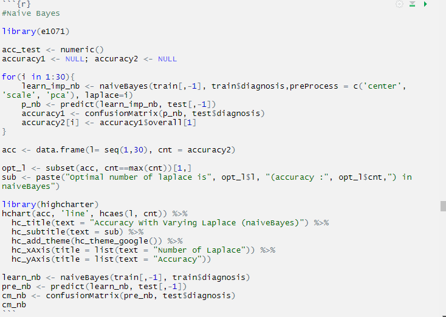

 
  

Based on this research the results obtained on computation of Naïve Bayes algorithm on breast cancer dataset is observed as follows:
Table 4.  Confusion Matrix for Naïve Bayes Algorithm
Prediction	Benign	Malignant
Benign	      72	     3
Malignant	     2	    37

As observed in the above table we can see that the designed model has derived inefficient results. Though the negative error is low as compared to the positive error of two NP predictions against three PN predictions, these errors reduce the efficiency level of the model.
The accuracy and the sensitivity derived by the Naïve Bayes model is as follows.
•	Accuracy: 95.61%
•	Sensitivity: 97.30%
Based on this generated data, we have designed a plot representing the ROC curve of the model which is explained as follows:
 
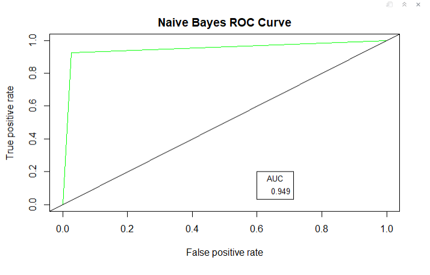

In this plot we can see the ROC curve with the calculated AUC value. ROC represents the sensitivity with which accurate data has been generated i.e. close to 0.96 whereas AUC i.e. 0.94.9, is the area that is calculated under the curve generated by the optimal accuracy that is calculated.

### Random Forest Algorithm

Based on the methodology of Random Forest algorithm, we compute this model for breast cancer diagnostics data set. The aim is to evaluate the accuracy and the sensitivity with which the data is being processed and the efficiency of results generated.
 
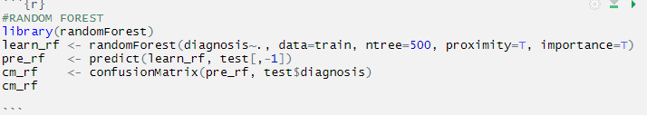  

Based on this research the results obtained on computation of Random Forest algorithm on breast cancer dataset is observed as follows:
Table 5. Confusion Matrix for Random Forest Algorithm
Prediction	Benign	Malignant
Benign	       74	     2
Malignant	      0	    38

As observed in the above confusion matrix table we can see that the predictions recorded are substantially well as compared to all the other algorithms that were tested on breast cancer dataset. Though the error in PN is very low, an accurate system must not contain this error as it may convey false message to the patients, like in this case it shows two PN predictions which interprets Benign tumour as Malignant.
The accuracy and sensitivity obtained by this model are as follows:
Accuracy: 98.25%
Sensitivity: 100%
Based on this generated data, we have designed a plot representing the ROC curve of the model which is explained as follows:
 
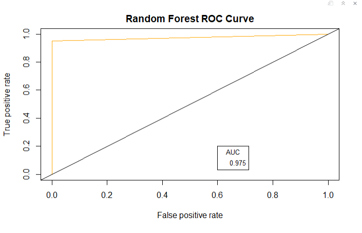

In this plot we can see the ROC curve with the calculated AUC value. ROC represents the sensitivity with which accurate data has been generated i.e. close to 0.98 whereas AUC i.e. 0.97, is the area that is calculated under the curve generated by the optimal accuracy that is calculated.

### Support Vector Machine Algorithm

Based on the methodology of Support Vector Machine algorithm, we compute this model for breast cancer diagnostics data set. The aim is to evaluate the accuracy and the sensitivity with which the data is being processed and the efficiency of results generated.
In this case we calculate SVM with a and without Tuning. First model generated is where there is no additional tuning applied to the features, whereas the second model represents the accuracy generated after effective tuning of the model.
Model 1:

 
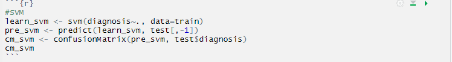

Based on this research the results obtained on computation of Support Vector Algorithm on breast cancer dataset is observed as follows:
Table 6. Confusion Matrix for Support Vector Machine Algorithm
Prediction	Benign	Malignant
Benign	      74	      1
Malignant	     1	     39

The above confusion matrix displays the ratio of accurate results obtained. There is a minor error in both NP and PN which can be interpret as on false malignant result presented as benign and one benign result presented as malignant. 
The accuracy and the sensitivity recorded for this model are:
•	Accuracy: 98.25%
•	Sensitivity: 98.65%
Based on this generated data, we have designed a plot representing the ROC curve of the model which is explained as follows:
 

In this plot we can see the ROC curve with the calculated AUC value. ROC represents the sensitivity with which accurate data has been generated i.e. close to 0.98.5 whereas AUC i.e. 0.98, is the area that is calculated under the curve generated by the optimal accuracy that is calculated.

### Model 2:

For this SVM model we tune the data in order to obtain highest level of accuracy.

 
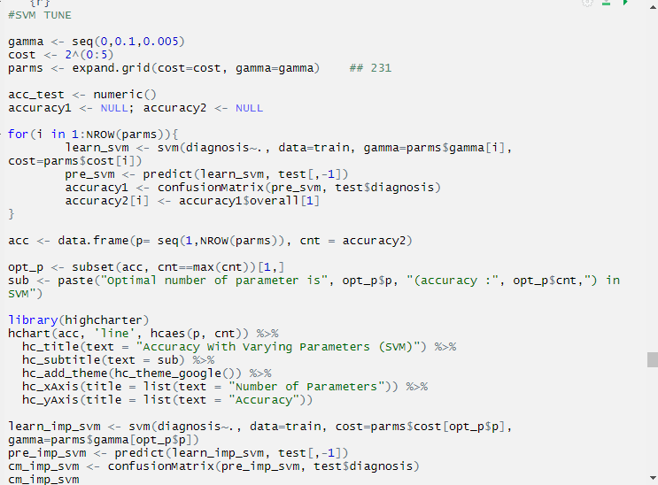

Based on this research the results obtained on computation of Support Vector (Tune) Algorithm on breast cancer dataset is observed as follows:
Table 7. Confusion Matrix for Support Vector Machine (Tune) Algorithm
Prediction	Benign	Malignant
Benign	     74	       1
Malignant	    0	      39

The above confusion matrix displays the ratio of accurate results obtained. There is a minor error where one PN prediction is observed. This is by far the most efficient and accurate model designed. 
With a substantial prediction accuracy as mentioned below, this algorithm can be considered the best model for breast cancer diagnostics 
Accuracy: 99.12%
Sensitivity: 100%
Based on this generated data, we have designed a plot representing the ROC curve of the model which is explained as follows:
 
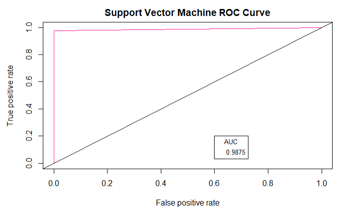

In this plot we can see the ROC curve with the calculated AUC value. ROC represents the sensitivity with which accurate data has been generated i.e. close to 0.99 whereas AUC i.e. 0.987, is the area that is calculated under the curve generated by the optimal accuracy that is calculated.

### Computing the optimal model for Diagnostics 

In this case we check which is the most accurate model for breast cancer diagnostics and test if the results derive on its implementation are quintessential.
 
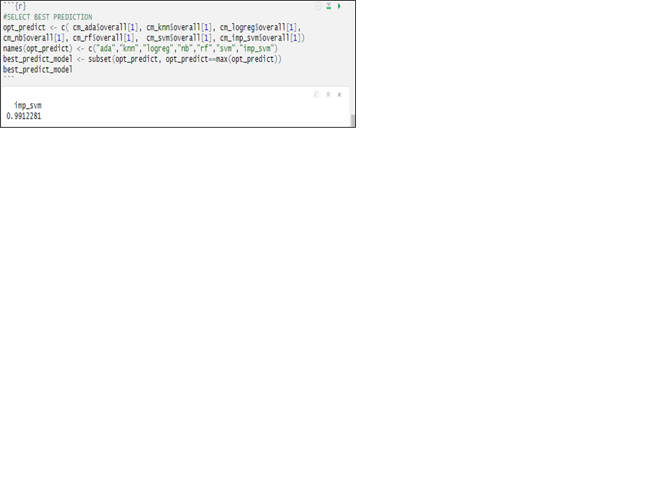

Based on this we can conclude that SVM Tune is the most accurate and efficient model for diagnosing breast cancer based on the data acquired.
