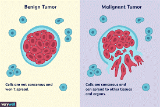
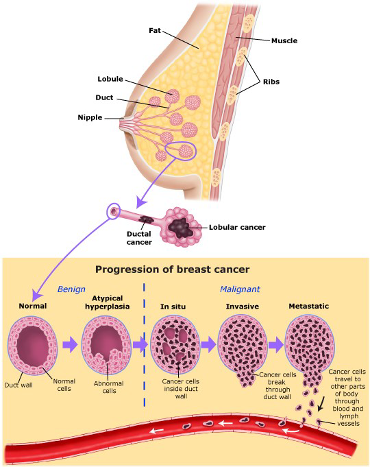
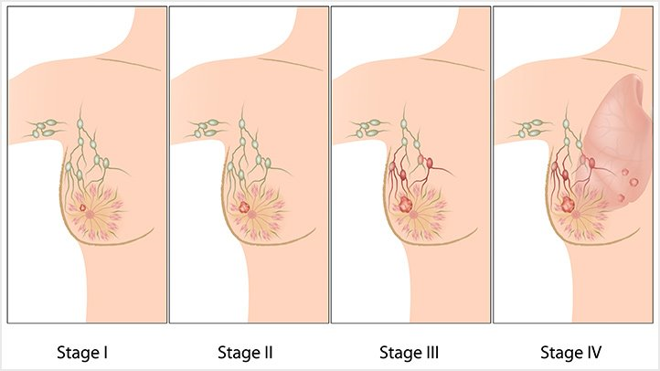

# Predictive-Analysis-of-Breast-Cancer-Detection-using-Classification

Breast Cancer is one of the frequently detected cancer in the world. The majority of the victims of this cancer are usually women. There are two types of tumours that a present in the body: benign and malignant. Benign tumour is an inactive tumour that is formed by clustering of dead cells. Though it may lead to some lumps in the body, they are not life threatening and can be treated by medication or if causing pain, by surgically removing it. Malignant tumours on the other side are life threatening tumours. They are a formation of cancerous cells clustered together in one place, this if not detected and treated immediately can be fatal to health.

There are various tests that have been devised for detecting the presence of tumour, some of them are Ultrasound, Mammography, MRI, Fine Needle Aspiration, Cytology, Core-cut biopsy. But the most effective and recommended test is self-check which involves frequently checking your body for any unnatural lump formation. Breast cancer like the name suggests is found in breasts.

 
 
There are four stages of breast cancer: Stage I, Stage II, Stage III, Stage IV. Stage I is the primary stage, cancer detected in this stage is usually controllable and easily curable. Stage II is where the lump grows in size and may or may not be easily visible on the outside. Stage III is when the cancer starts spreading into the veins and the lump is easily detected on the outside. Till this stage it is still possible to restrict the cancer by chemo or in worst case by performing mastectomy surgery. Stage IV is the last phase. It is when the cancer becomes so strong that it spreads to other organs. It is very difficult to recover from this stage as the survival rate has been evaluated to be very low.

To minimise the victim count it is substantial that the cancer is detected in the initial stage where in it is still deemed curable. For this to be possible, the process of breast cancer diagnostics needs to be redefined. Usually the patients are diagnosed either at a very later stage or ignored based on miscalculations and wrong diagnostics. It is requisite that a system to be designed which will increase the speed of the diagnostics process and reduce the error rate. The purpose of this research is to achieve one step towards this approach.

With computers dominating every industry, medical industry is also one domain where it could be utilised significantly. These computers can help in redesigning and improving the method of cancer diagnostics by implementing systems that can help compute faster and efficient results. This can be achieved with the help of Machine Learning Algorithms. Machine learning as a whole is a widespread field of science which had reconditioned the process of research. In this research we discuss about the significance of machine learning and how it can be used for better diagnostics.
The dataset used for this research is based on the data accumulated through fine needle aspirate (FNA) of a breast mass. This data contains the target variables which are used to detect whether the cancer present in the patient is malignant or not. This will be attained by computing different algorithms and evaluating the best that can be used to reduce the time required for diagnostics of breast cancer in patients. 

Adaboost, Decision Tree, Naïve Bayes, Logistic Regression and Support Vector Machine are the algorithms that will be used in this research. To ensure data accuracy Principal Component Analysis will be performed on the dataset to define the main components which can easily define the data and help achieve effective results.
